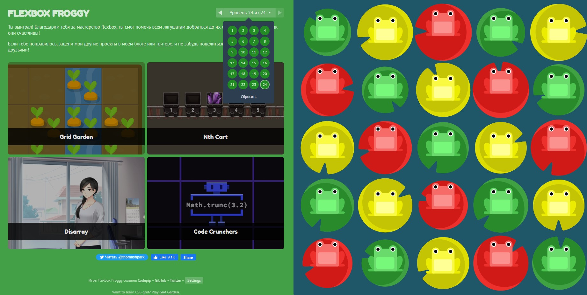

# kottans-frontend
<details>
<summary>General</summary>

 - [x] Git Basics
 - [x] Linux CLI, and HTTP
 - [x] Git Collaboration

</details>

<details>
<summary>Front-End Basics</summary>

 - [x] Intro to HTML & CSS
 - [x] Responsive Web Design
 - [x] HTML & CSS Practice
 - [x] JavaScript Basics
 - [x] Document Object Model - practice

</details>

<details>
<summary>Advanced Topics</summary>

 - [x] Building a Tiny JS World (pre-OOP) - practice
 - [x] Object oriented JS - practice
 - [ ] OOP exercise - practice
 - [ ] Offline Web Applications - optional
 - [ ] Memory pair game — real project!
 - [ ] Website Performance Optimization - optional
 - [ ] Friends App - real project!

</details>

---

## 0. Git Basics

<details>
<summary>Screens</summary>
  


  
</details>

It's all new for me and I'm really excited to learn new stuff, especially about Git, because I haven't used it very often in my projects and all these things related to Git were always difficult for me and I wanted to understand what is going on here from the very beginning.

---

## 1. Linux CLI, and HTTP

<details>
<summary>Screens</summary>
  


  
</details>

1. Everything that was in this lesson was new for me
2. It was surprising for me that Linux OS is so powerful and simple to learn at the same time. At first commands may seem difficult and even irritating, but actually they're pretty simple
3. I do not use Linux in my daily life, but I'm sure I will use these commands I already learned in Git Bash terminal

---

## 2. Git Collaboration

<details>
<summary>Screens</summary>
  


  
</details>

1. Every single topic in this module was new for me. Especially branching, working with remote repositories (push & pull, resolving conflicts and Pull Requests)
2. For me it was really surprising that working in Git Bash could be so simple and handy. I've never learned about things like branches in Git, merging them and working with remote repo, so it was pretty exciting
3. Since I joined Kottans, I would definitely use these things for my learning path here: making commits, resolving issues and conflicts in repo, working with remote repo, using Git Bash more certain in my work and tracking commit's history by ```$ git log --graph --oneline ``` (I'm obsessed with this command)

---

## 3. Intro to HTML and CSS

<details>
<summary>Screens</summary>
  


  
</details>

1. Except forms there wasn't much new for me because I studied HTML & CSS before, but it was really useful to recover the basics from my memory since it was a year I started learning Web Development
2. I was plesantly surprised that I can rewatch basics in Coursera anytime and don't be afraid of forgetting something
3. Since it's the basics I can't deny the fact that I must use all of these from the beginning to the end

---

## 4. Responsive Web Design 

<details>
<summary>Screens</summary>
  


  
</details>

1. I have learned resposive web design before and practicing it everytime so it wasn't difficult for me, but very useful for recovering old knowledges
2. I've done these two games before and it was surprising how easy they seem for me today
3. Everything I've learned I will use in my projects, inlcuding media queries, flexbox an grids

---

## 5. HTML & CSS Practice

[Demo Page](https://the-darkesttt.github.io/hooli-style-popup/)

[Code Base](https://github.com/the-darkesttt/hooli-style-popup)

I have never received a review for my work before. This is one of the many reasons why I like Kottans. Getting a review from a person many times superior to you is an invaluable experience

---

## 6. JS Basics

<details>
<summary>Screens</summary>
  
  


  
</details>

Although I learned most of this module on my own, it was helpful to go over the basics again to solidify my knowledge. Many things that were not clear to me before became clear, such as closures and function constructors. I understand that I have to learn ten times more than I know now

---

## 7. DOM

<details>
<summary>Screens</summary>


</details>

[Demo Page](https://the-darkesttt.github.io/dom-task/)

[Code Base](https://github.com/the-darkesttt/dom-task)

Before Kottans, I had almost never been given the opportunity to use JS for web pages in the DOM. I enjoyed solving this problem, although at first it seemed like something scary, because I had never solved this type of problem. Now I feel much more confident in using JS in web pages. And again, I am grateful to Kottans for the opportunity to get a quality review of my code!

---

## 8. Building a Tiny JS World

[Demo Page](https://the-darkesttt.github.io/a-tiny-JS-world/)

[Code Base](https://github.com/the-darkesttt/a-tiny-JS-world)

A very useful, albeit simple, task that helped me better understand exactly how OOP works and what it is based on. It was interesting to learn about prototypes and properties of objects

---

## 9. Object Oriented JS

<details>
<summary>Screens</summary>


</details>

[Demo Page](https://the-darkesttt.github.io/frontend-nanodegree-arcade-game/)

[Code Base](https://github.com/the-darkesttt/frontend-nanodegree-arcade-game)

Almost everything that was in this task was new to me and at first completely incomprehensible. It took a lot of effort just to get started. Nevertheless, I am very proud of the work I've done (although I know that it is far from ideal). I really enjoyed developing the game. This assignment helped me understand and put into practice OOP without being afraid that it is something super-complex. I think I would like to develop more complex games in the future